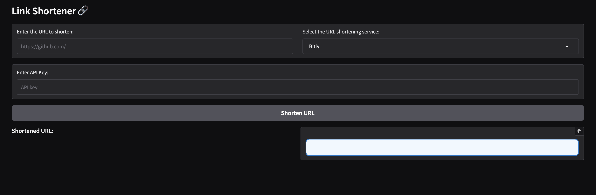

TODO:

[] Deploy with Elastic BeanStalk
[] Add services:
- Adf.ly
- Chilp.it
- Clck.ru
- Da.gd
- Git.io
- Is.gd
- NullPointer
- Os.db
- Ow.ly
- Po.st
- Qps.ru
- Short.cm
- Tiny.cc
- Git.io
- Tiny.cc

# URL Shortener

This is a Python program that helps to generate shorten url through multiple services



### Installation

```
pip install -r requirements.txt
```

### The servicing services for shorten URL:

- Bitly
- Cuttly
- TinyURL
